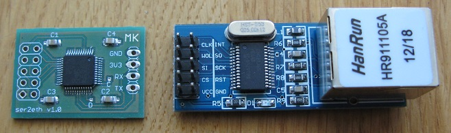
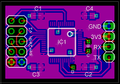
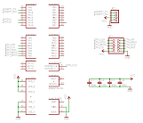

### Serial to ethernet

The _serial to ethernet_ module adds TCP/UDP connectivity to your project. I took on this project after testing several
cheap modules from eBay, that did not perform as expected.

To compile the sources my STM32F10x library is required.

The ENC28J60 module is from eBay, the only addition is the STM32F100 ARM microcontroller, making this a lot more a
software project than hardware. The module works @3.3V. Since the ENC module makes 6.25 MHz clock available on one
of its pins, the MCU uses that for system clock so an extra crystal is not required. The module draws about 90mA.

The module is driven by AT commands. Starting baud rate is 38400.

Currently:

* IP configuration is available with DHCP only. Static configuration is achievable by configuring the module with DHCP first and then saving/loading the configuration from flash.
* Only a single simultaneous TCP/UDP connection is possible.
* No higher level protocols (http,smtp,...) are implemented. You're expected to do that in the application using the module.
* MAC is set using the MCU's unique identifier
* The send/receive protocol is designed to handle ASCII data, not binary.

#### General commands:

Command | Description
--------|-------------
AT | Returns OK
ATE1 ATE0 | Echo on/off
ATI | Returns ID string
AT+IPR=_baud_ | Change baud rate

#### IF configuration commands (pre TCP/UDP/DNS):

Command | Description
--------|------------
AT+LWIPINIT | Init lwIP and hw interface
AT+LWIPMAC=? | Returns hw interface MAC
AT+LWIPDHCP | Starts automatic IP configuration via DHCP
AT+LWIPIP=? | Returns currently configured own IP
AT+LWIPNM=? | Returns currently configured netmask
AT+LWIPGW=? | Returns currently configured gateway
AT+LWIPSAVE | Stores current IP configuration to flash
AT+LWIPLOAD | Restores IP configuration from flash

#### TCP commands:

Command | Description
--------|------------
AT+TCPCONNECT=_dst_ip_,_dst_port_,_src_port_ | Connect to dst_ip:dst_port from src_port
AT+TCPLISTEN=_port_ | Start listening on port
AT+TCPSEND | Send data over established connection
AT+TCPCLOSE | Close connection

#### UDP commands:

Command | Description
--------|------------
AT+UDPCONNECT=_dst_ip_,_dst_port_ | Set peer IP and port
AT+UDPLISTEN=_port_ | Start listening for packets on port
AT+UDPSEND | Send packet to peer
AT+UDPCLOSE | Forget peer IP and port

#### DNS commands

Command | Description
--------|------------
AT+DNS=? | Returns currently configured DNS servers
AT+DNSLOOKUP=_hostname_ | Resolves hostname to IP using the configured DNS server

#### Usage

After powerup, the hardware and lwIP library need to be initialized with __AT+LWIPINIT__. Next the IF needs
to be configured by either calling __AT+LWIPDHCP__ or, if the IP settings have been previously saved to flash,
__AT+LWIPLOAD__. At this point TCP/UDP connections are ready to be made.

Connections are initiated by the module with __AT+[TCP/UDP]CONNECT__ command. The TCP version does actual connection
handshaking with the peer and signals a successfully established connection with __+LWIP: CONNECT__.
The UDP version simply sets internal peer IP and port variables and immediately returns with __OK__. The UDP connection
is therefore virtual - no data is actually being sent on the wire. Note that the CONNECT commands accept peer parameter
in the form of an IP address only. If you want to use hostnames, you need to manually lookup your peer's IP using the
__AT+DNSLOOKUP__ command.

To listen for incoming connections use __AT+[TCP/UDP]LISTEN__. The TCP version behaves exactly like the outbound
version, i.e. when a client connects the module will signal so with __+LWIP: CONNECT__. The UDP version treats
the first received packet as a virtual connection opener - upon reception, the peer IP and port will be remembered and
the packet contents output.

To send data, use __AT+[TCP/UDP]SEND__. Upon command reception, the module outputs __>__ and waits
for data. Character __0x1a__ (Ctrl-Z) is data terminator. The protocol is designed to transfer ASCII
data and not binary.

All received TCP/UDP data is sent over the serial interface immediately.

To close a connection (and possibly begin a new one), use __AT+[TCP/UDP]CLOSE__. The TCP version will inform the
peer to gracefully close the connection and signal completion with __+LWIP: CLOSE__. For UDP this simply means
the stored peer IP and port are forgotten and __OK__ is returned immediately.

#### Init example

Command|Reponse|Comment
-------|-------|-------
AT||
 |OK|
ATI||
 |MK ser2eth v1.5 OK||
AT+LWIPINIT||
 |OK|
AT+LWIPDHCP||
 |OK|
 |+LWIP: IFSTAT|Sent after DHCP completes
AT+LWIPIP=?||
 |+LWIPIP: 192.168.1.18 OK|

#### TCP example

Command|Reponse|Comment
-------|-------|-------
AT+DNSLOOKUP=www.google.com||
 |OK|
 |+LWIPDNS: 74.125.136.103|Sent after DNS resolution completes
AT+TCPCONNECT=74.125.136.103,80,1234||
 |OK|
 |+LWIP: CONNECT|Sent after connection is established
AT+TCPSEND||
 |512>|Number before > is bytes of buffer free
GET / HTTP/1.1 Host: google.com||Send 0x1a (Ctrl-Z) to end data entry
 |OK|
 |HTTP/1.1 302 Found Location: http://www.google.si/ Cache-Control: private Content-Type: text/html; charset=UTF-8 (removed the rest of reply)|Server response is sent immediately upon reception
AT+TCPCLOSE||
 |OK|
 |+LWIP: CLOSE|Sent after connection is closed

To listen instead of connecting, simply replace AT+TCPCONNECT=ip,port,srcport with AT+TCPLISTEN=port. In both cases +LWIP: CONNECT signals that the connection was established.

#### UDP example

Command|Reponse|Comment
-------|-------|-------
AT+UDPCONNECT=192.168.1.5,1234 | OK | Begin a virtual UDP connection.
AT+UDPSEND ||
| 512> | Number before > is max packet size
hello world || Send 0x1a (Ctrl-Z) to end data entry
| OK |
AT+UDPCLOSE ||
| OK |

To listen instead of connecting, replace AT+UDPCONNECT=ip,port with AT+UDPLISTEN=port and wait for the first packet to arrive.

#### Bill of materials

Qty | Value / Farnell code | Device | Size | Parts
----|----------------------|--------|------|------
1 | 1838512 | STM32F100    | LQFP48 | IC1
4 | 100n    | multilayer   | 0805   | C1, C2, C3, C4
